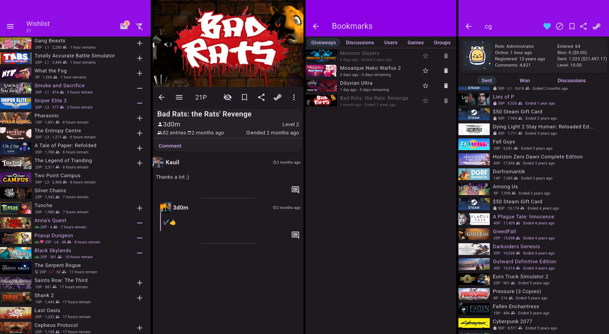
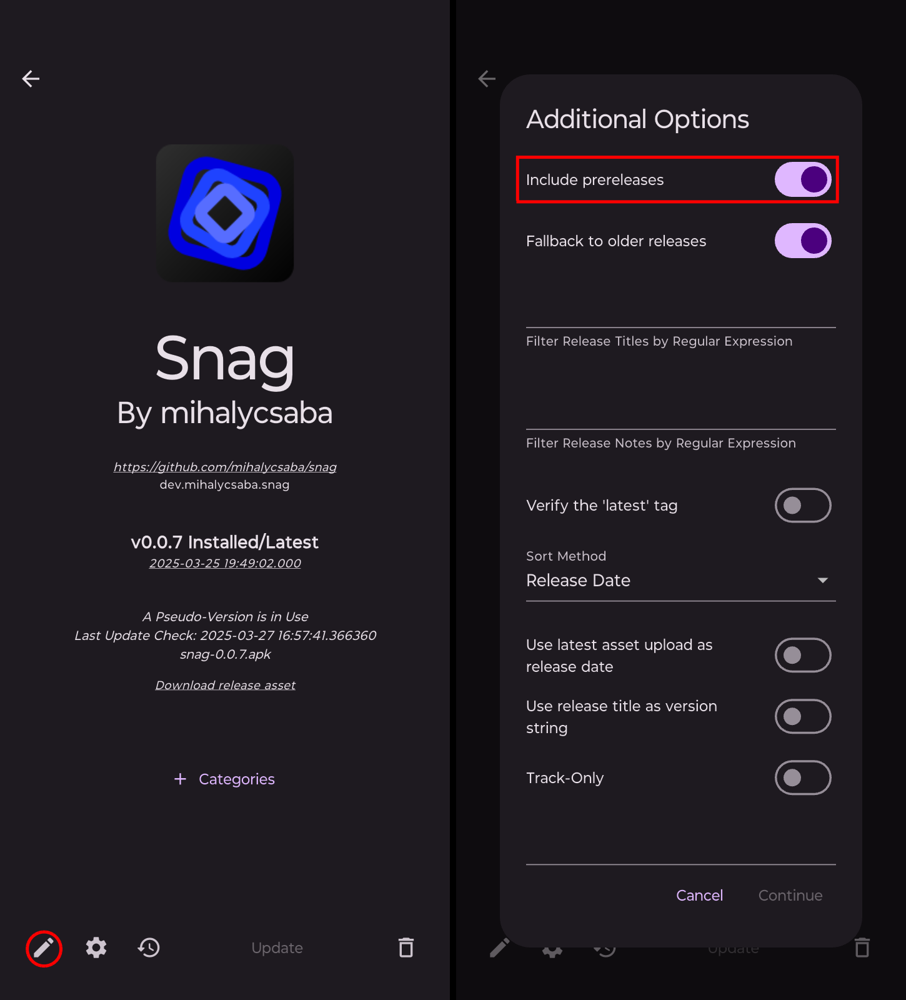

#  Snag

Client application for [steamgifts.com](https://www.steamgifts.com/). Made with [Flutter 🩵](https://flutter.dev/).

## Screenshots

## Features

- Notificaions for winning, ended giveaways and new messages.
- Notification after having a certain number of points.
- Bookmarking giveaways, discussions, users, games and groups.
- Almost complete functionality of the website is available.

## Installation

Minimum Android version: 10

On older versions, you should use: [sg](https://github.com/PrOF-kk/SteamGifts)

You will need a [steamgifts.com](https://www.steamgifts.com/) account to use this app.

Download from [Github](https://github.com/mihalycsaba/snag/releases/latest)

## Updating

You can use [Obtainium](https://github.com/ImranR98/Obtainium) for updates.

Copy the repository URL `https://github.com/mihalycsaba/snag` into the Obtainium Add App page.

You can get prerelease versions with Obtainium by enabling `Include prereleases`.

## Build

The app should always be built with the latest stable version of Flutter.

Latest release was built with Flutter version: `3.35.6`

## Contributing

Do it with updated plugins `flutter pub upgrade`

Run release.sh to test if it builds.

Explain your pull requests. Try to create separete PRs for each feature or fix.

## TODO

- Creating discussion.
- Creating giveaway.
- Release an iPhone version.
